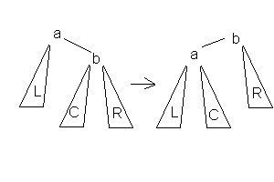
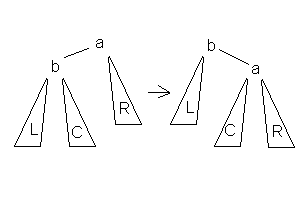
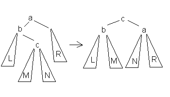
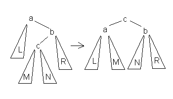

Учебная задача. Вроде даже работает! Сделаль Волков Денис, студент ФТ-201.

# Реализация АВЛ-дерева

> **АВЛ-дерево** — сбалансированное по высоте двоичное дерево поиска: для каждой его вершины высота её двух поддеревьев различается не более чем на 1.
>
> АВЛ — аббревиатура, образованная первыми буквами фамилий создателей (советских учёных) Адельсон-Вельского Георгия Максимовича и Ландиса Евгения Михайловича.

АВЛ-дерево — это двоичное дерево поиска, ключи которого удовлетворяют стандартному свойству: ключ любого узла дерева не меньше любого ключа в левом поддереве данного узла и не больше любого ключа в правом поддереве этого узла. Это значит, что для поиска нужного ключа в АВЛ-дереве можно использовать стандартный алгоритм. 

## Высота дерева

Особенностью АВЛ-дерева является то, что оно является сбалансированным в следующем смысле: *для любого узла дерева высота его правого поддерева отличается от высоты левого поддерева не более чем на единицу*. Доказано, что этого свойства достаточно для того, чтобы высота дерева логарифмически зависела от числа его узлов: высота h АВЛ-дерева с n ключами лежит в диапазоне от log2(n + 1) до 1.44 log2(n + 2) − 0.328. А так как основные операции над двоичными деревьями поиска (поиск, вставка и удаление узлов) линейно зависят от его высоты, то получаем *гарантированную*логарифмическую зависимость времени работы этих алгоритмов от числа ключей, хранимых в дереве.

## Балансировка 

Идея сбалансированности: в случае разницы высот левого и правого поддеревьев на 2 будем менять связи предок-потомок в поддереве данной вершины так, чтобы разница становилась <= 1. Такой эффект достигается путем вращения поддерева данной вершины. Используется 4 типа вращений:

- **Малое левое вращение** 

  

- **Малое правое вращение**

  

- **Большое левое вращение**. Можно получить через МПВ(вокруг b) + МЛВ(вокруг a)

  ​

   

- Большое правое вращение. Можно получить через МЛВ(вокруг b) + МПВ(вокруг а)

  

  ## Вставка элемента

  1. Проходим по пути поиска, пока не убедимся, что ключа в дереве нет.
  2. Включаем новую вершину как в стандартной операции вставки в дерево поиска.
  3. "Отступаем" назад от добавленной вершины к корню. Проверяем в каждой вершине сбалансированность. Если разность высот поддеревьев равна 2 - выполняем нужное вращение. 

  Время работы O(log n)

  ## Удаление элемента

  1. Ищем вершину D, которую требуется удалить.
  2. Проверяем, сколько поддеревьев в D:
     - Если D - лист или D имеет одно поддерево, то удаляем D.
     - Если D имеет 2 поддерева, то ищем вершину M, следующую по значению после D. Как в стандартном алгоритме удаления из дерева поиска. Переносим значение из M в D. Удаляем M.
  3. "Отступаем" назад от удаленной вершины к корню. Проверяем в каждоый вершине сбалансированность. Если разность высот поддеревьев равна 2 - выполняем нужное вращение.

  Время работы O(log n)